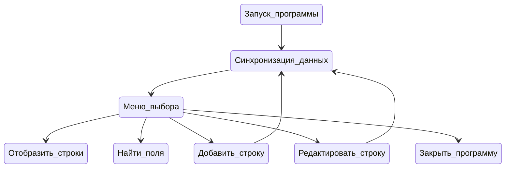

# Телефонный справочник
## Запрашиваемые возможности:
1. Вывод постранично записей из справочника на экран
2. Добавление новой записи в справочник
3. Возможность редактирования записей в справочнике
4. Поиск записей по одной или нескольким характеристикам
## Требования к программе:
1. Реализация интерфейса через консоль (без веб- или графического интерфейса)
2. Хранение данных должно быть организовано в виде текстового файла, формат которого придумывает сам программист (пример файла "Data.txt")
3. В справочнике хранится следующая информация: фамилия, имя, отчество, название организации, телефон рабочий, телефон личный (сотовый)

## Информация о программе:
Все программа выполняется внутри класса PhoneBook, поэтому при вызове "pydoc ./phone_book.py" из командной строки, вы можете получить доступ к аннотациям и документации каждой функции внутри программы.

Базовый функционал включает в себя:

***1. Просмотр*** содержания таблицы с выводом заданного количества строк или целиком и возможностью ***сортировки*** содержимого

***2. Поиск*** внутри файла по одному или нескольким полям

***3. Добавление*** новой строки в конец файла

***4. Редактирование/удаление*** строки из файла

NOTE:
Каждая из перечисленных опций, после выполнения запроса, возвращается в начальное меню, где может быть выбрана следующая операций или произведен выход из программы.

Навигация внутри программы осуществляется путем ввода числовых кодов, выбор полей для редактирования - путем ввода индексов соответствующих полей.

Для отображения таблиц в консоли используется библиотека prettytable

### Демо с использованием функций


https://github.com/Dopelen/Phone_book/assets/141639888/b3e4290c-6a21-446f-a3c3-4281a82c8cf4


### Запуск программы
Помимо стандартных модулей python, внутри программы используется модуль [PrettyTable](https://pypi.org/project/prettytable/)

Он может быть установлен через консоль командой: 

```python
python -m pip install -U prettytable'
```

Доступна установка с использованием requirements.txt:
```python
pip install -r requirements.txt
```


*P.S: Также будте уверены, что ширина консоли соответствует ширине содержания таблицы, иначе формат отображения может быть не оптимальным.*


### Блок-схема работы функций




### Структура файла Data.txt:
Разделитель между полями "\t"

1-ый стобец содержит уникальный идентификатор строки в формате: "ID_*уникальное_число*"

Остальные поля идут в порядке: фамилия, имя, отчество, название организации, телефон рабочий, телефон личный (сотовый)

Пример строки в raw формате:

*ID_2\tСудакова\tМарьяна\tРобертовна\tВиртуальная Лаборатория\t+72345678901\t+79023456789\n*
